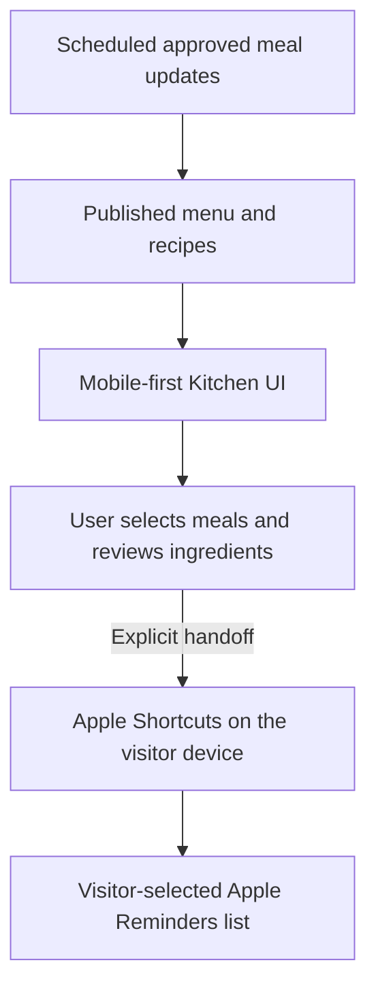

# Estelle’s Kitchen

Estelle’s Kitchen is a deployed household meal-planning and grocery workflow designed to turn recurring family decisions into a structured, automated experience.

**Status: Production / Deployed** · [Live experience](https://geoffreyruntime.com/estelles-kitchen/) · [Architecture](architecture.md) · [Engineering case study](engineering-case-study.md)

## The project in 60 seconds

- **The problem:** deciding what to cook, finding the right recipe, and moving ingredients into a usable shopping list creates recurring coordination work.
- **What shipped:** a mobile-first public experience with today’s recipe, a seven-day menu, recipe details, multi-meal ingredient review, and an Apple Shortcuts handoff to the visitor’s chosen Reminders list.
- **The engineering:** scheduled approved meal updates feed a clear public recipe experience. Waiting states avoid presenting unavailable information as current. Grocery actions require an explicit review and handoff.
- **The result:** a working website-to-native-app workflow. The final Add helper was verified on an actual device from the live website through to the selected Reminders list.
- **Project ownership:** owner-directed requirements, architecture, integration decisions, testing, review, and deployment, with AI-assisted implementation.

This is a focused, deployed personal-automation project. Its engineering value is in connecting systems responsibly and handling their boundaries clearly.

## See the shipped experience

Actual public-page desktop captures. [View the complete screenshot walkthrough and capture limits →](screenshots.md)

## Why build it?

A meal plan is useful only if it survives the next steps: opening the correct recipe, knowing what ingredients are needed, and getting those ingredients into a list someone can actually use.

Estelle’s Kitchen connects those steps while keeping the public experience simple. The household planning workflow supplies the published menu and recipes. Visitors see the published menu, choose which meals to shop for, review the ingredients, and decide when to send them to Apple Shortcuts.

## What the experience does

1. **See today’s meal.** Read the current recipe, ingredient quantities, instructions, and available serving and timing information.
2. **Browse the week.** Open details for meals in the published seven-day menu.
3. **Shop ahead.** Select one or more published meals and review every ingredient before leaving the browser.
4. **Add to a personal grocery list.** Apple Shortcuts adds one reminder per ingredient line to the list chosen during helper installation.
5. **Stay in control.** Repeated runs add another copy. Shared ingredients stay separate so quantities are not silently combined or lost.

The public page lets visitors select meals **for a grocery handoff**. Editing the household meal schedule remains outside the public interface.

### Apple setup

Open the [live Kitchen](https://geoffreyruntime.com/estelles-kitchen/#grocery-setup) for the current setup instructions and helper downloads.

- **Estelle Grocery Add:** install the ingredient helper, keep its name unchanged, and choose the destination list during setup.
- **Estelle Grocery Setup:** optional one-time list creation. If a suitable list already exists, skip it or cancel. Running Setup again can create another list.
- Review ingredients on the website, then choose **Add ingredients in Shortcuts**. Apple may request permission to open Shortcuts or access Reminders.

Recipe browsing works independently of the Apple integration. The website cannot read the visitor’s reminders or verify that a native add completed.

## Architecture at a glance

The website presents the published menu and recipes. Visitors choose meals for groceries and explicitly initiate the handoff to Apple Shortcuts on their own device. Private planning and publication implementation are outside this public overview.

[Read the public product flow →](architecture.md)

## Reliability decisions

- **Keep the public experience focused.** Visitors see published recipes and shopping actions, without private household planning records.
- **Show honest fallback states.** Waiting or unavailable states explain when the current menu cannot be shown.
- **Review before handoff.** Ingredient previews make quantities visible before opening another app.
- **Keep input bounded.** Large selections may need to be split into smaller groups.
- **Avoid misleading success.** Opening Shortcuts is reported as a handoff, not proof that Reminders changed.
- **Test the real integration.** Automated and structural checks were paired with native helper inspection and an actual device end-to-end run.

## Implementation

- **UI:** HTML, CSS, vanilla JavaScript, JSON, and responsive layouts.
- **Scene motion:** Canvas animation with a shared Pause/Play control, a saved browser preference, and system reduced-motion support.
- **Meal updates:** scheduled approved updates supply the public menu; the private implementation is not included here.
- **Native integration:** Apple Shortcuts and Apple Reminders.
- **Verification:** automated checks, browser review, native Shortcut inspection, and device-level acceptance testing.

The illustration is a dated, static asset with animated scene layers. Automatic daily image generation is not part of the deployed workflow. AI-assisted development does not imply an LLM runs on every page view or grocery action.

## Engineering lessons

The hardest work was keeping behavior honest across systems: a valid data structure is not proof that a native action uses the intended input; a successful publication is not proof that it is current; opening another app is not proof of completion.

The resulting experience uses clear expectations, understandable failure states, and user-visible control at each step. [Read the engineering case study →](engineering-case-study.md)

## Roadmap

Potential next steps, not shipped capabilities:

- More systematic device and OS compatibility testing for the grocery handoff.
- Responsive-layout hardening for long recipe names, including a desktop weekly-card overlap observed during capture.
- Quantity-aware ingredient consolidation, only after units and duplicate behavior are defined and tested.
- Clearer installation diagnostics and recovery guidance across Apple devices.
- Daily illustrations with review for accuracy and a clear dated fallback.
- Broader personalized planning experiences, subject to explicit privacy and permission design.

## Scope, privacy, and licensing

This repository provides public project documentation. It does not include private backend code, credentials, internal service endpoints, personal household records, or production operating instructions.

No usage scale, uptime, performance benchmark, or enterprise-readiness claim is made. Production status refers to the deployed household experience. Existing [repository licensing](../../LICENSE) and applicable file-specific notices remain in force; this documentation grants no additional rights to branding or artwork.
