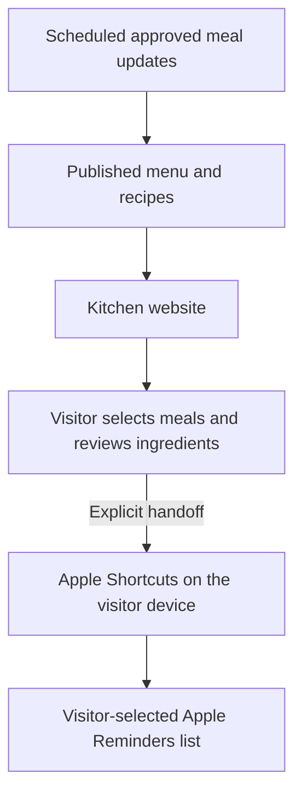

# Architecture: Estelle’s Kitchen

[Project overview](README.md) · [Engineering case study](engineering-case-study.md)

## A public product view

Estelle’s Kitchen connects approved meal updates, a mobile-first recipe experience, and a visitor-controlled grocery action. This overview describes the visible product and its integrations. The private planning and publication implementation is outside its scope.

## Published menu and recipes

The website presents today's available recipe and a seven-day menu. Recipe details include ingredients and instructions, with serving and timing information where available. Visitors can browse meal details and choose which published meals to shop for.

Choosing meals for groceries does not edit the household meal schedule. Approved meal updates reach the public experience separately from the visitor's grocery actions.

## Website experience

The public interface uses HTML, CSS, vanilla JavaScript, and JSON. Responsive layouts support recipe browsing and ingredient review on smaller screens.

The page distinguishes an available menu from a waiting or unavailable state. When the current menu cannot be verified, the experience avoids presenting a substitute as current. A changed menu can require the visitor to review their grocery selection again.

The illustrated scene uses Canvas motion, with one Pause/Play control and support for system reduced-motion preferences. A dated illustration is labeled separately from the current meal information. Automatic daily artwork generation is not a shipped feature.

These are implemented interaction features, not a claim of comprehensive accessibility or device certification.

## Grocery workflow

1. The visitor chooses one or more published meals.
2. The website previews ingredient lines and quantities.
3. The visitor explicitly chooses to open Apple Shortcuts.
4. The installed **Estelle Grocery Add** helper adds ingredients to the Reminders list selected during setup.
5. The visitor checks the result in their native app.

The handoff uses ingredient text and bounded input. Large selections may need to be split into smaller groups. Each ingredient remains separate; the current experience does not consolidate quantities or deduplicate reminders.

Repeated Add runs create another copy. The website cannot read the visitor’s reminders or confirm that a native add completed, so opening Shortcuts is presented as a handoff rather than a success receipt.

**Estelle Grocery Setup** is optional list creation. Visitors who already have a suitable list can skip it or cancel. Running Setup again can create another list.

## User control and privacy

- Visitors review ingredients before sending them to Shortcuts.
- The destination list is chosen by the visitor during helper setup.
- Apple may ask for permission to open Shortcuts or access Reminders.
- Reminders may sync through the visitor’s own Apple account.
- This public documentation omits private backend implementation, credentials, personal household records, and operating instructions.

## Deployment

The product is deployed at [geoffreyruntime.com/estelles-kitchen](https://geoffreyruntime.com/estelles-kitchen/). This repository documents the shipped experience and engineering lessons; it is not a distributable copy of the private production system.
