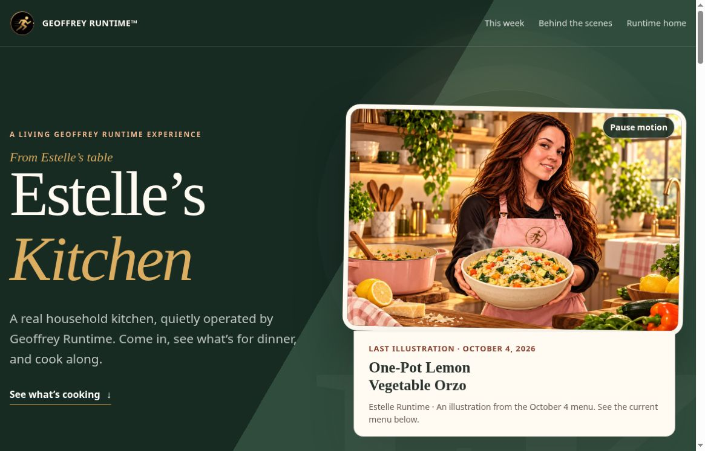
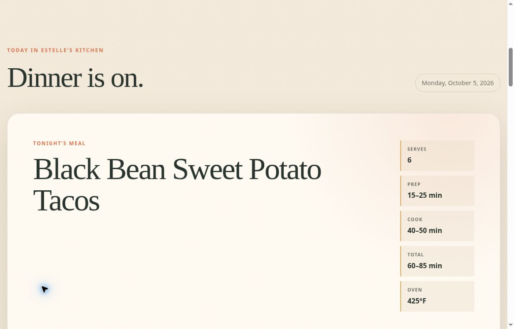
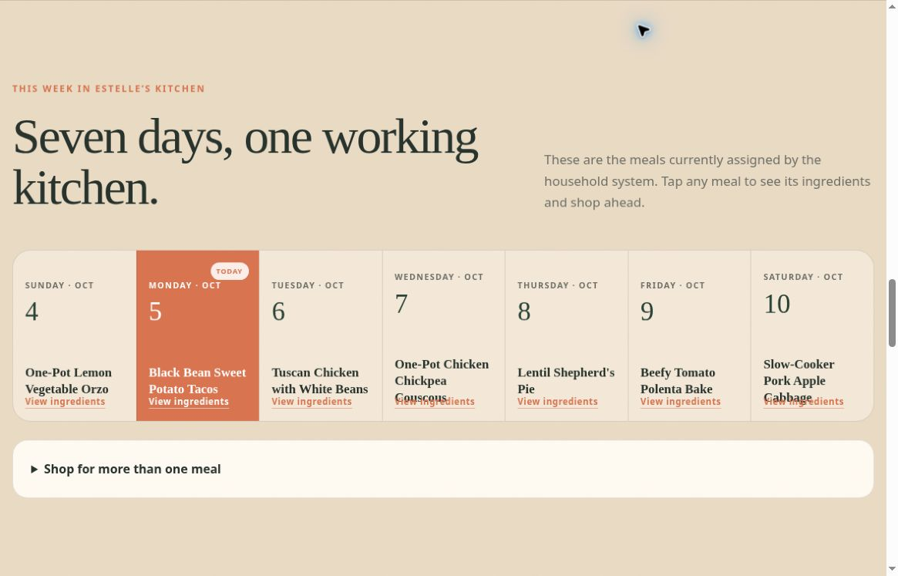
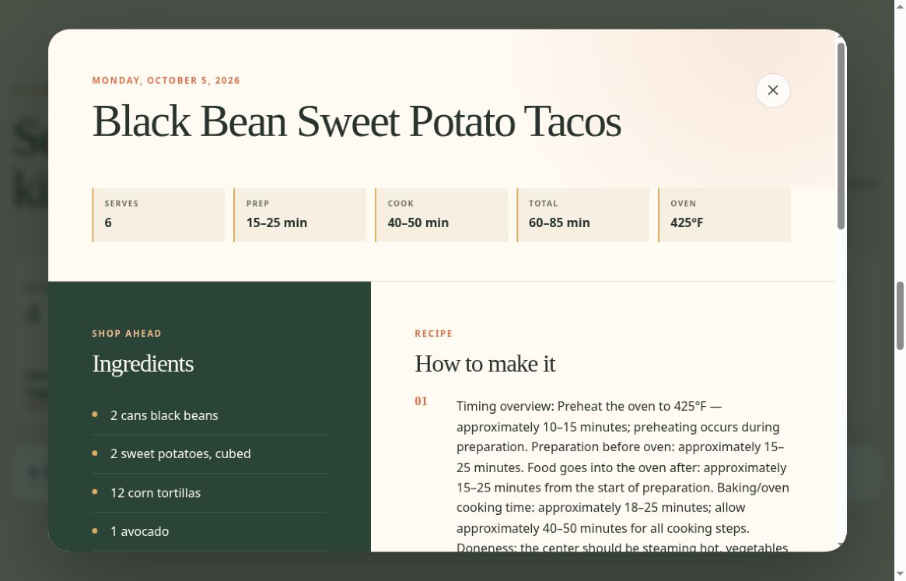
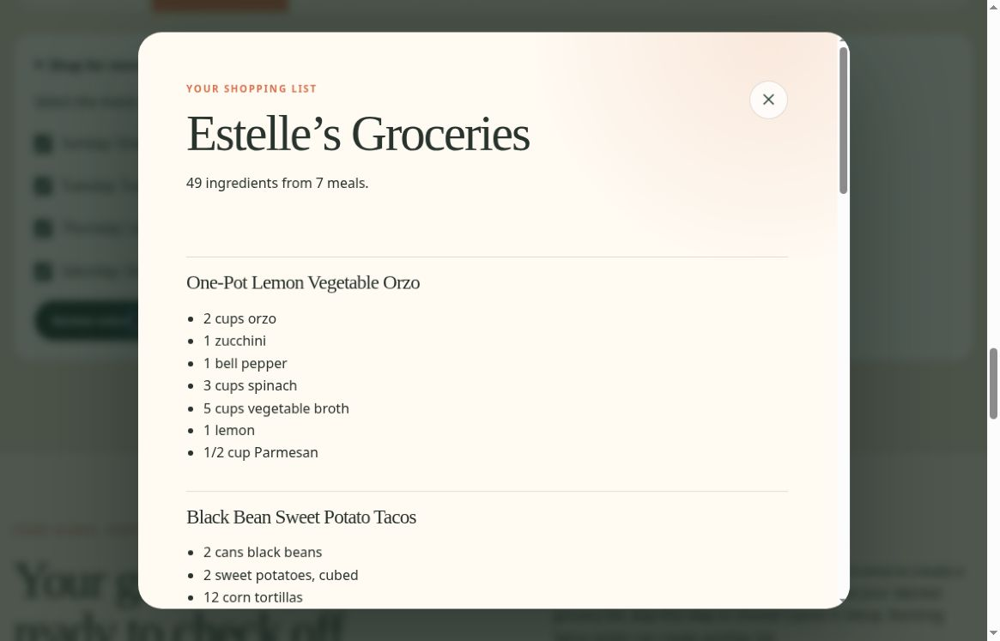
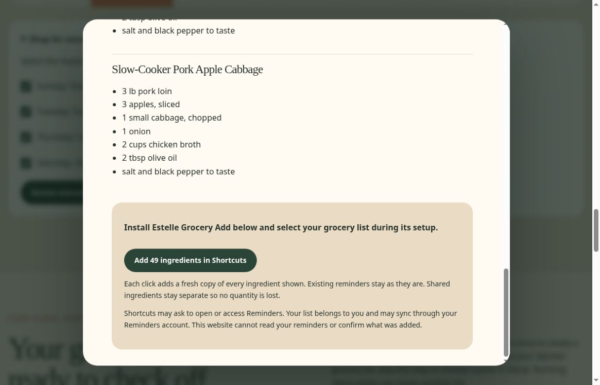

# Public screenshot walkthrough

[Project overview](README.md)

These are actual captures of the [deployed public Kitchen](https://geoffreyruntime.com/estelles-kitchen/), taken October 6, 2026, at approximately 04:42–04:44 UTC. The page displayed its October 5 menu. All images are desktop viewport captures at 1165 × 747 pixels, converted to PNG without compositing or content alteration.

Screenshots show public recipes and interface states only. No native Shortcut was launched during capture, and no personal Reminders list is shown. The 49-ingredient preview is one observed menu, not a general capacity promise.

## 1. Public kitchen landing page, desktop capture.

## 2. Today’s public recipe header and recipe facts.

## 3. Seven-meal menu; real desktop rendering including long-title overlap.

## 4. Public recipe and ingredient preview opened from the weekly menu.

## 5. Read-only grocery preview for all seven selected meals.

## 6. Native handoff disclosure before activating Shortcuts; no launch performed.

## Capture limits and known issue

- Mobile screenshots and a dedicated mobile visual pass are still pending. The implementation includes responsive layouts, but these images document desktop behavior only.
- In the weekly menu, long meal names overlap the ingredient link in two cards. The screenshots preserve that rendering; long-title layout hardening remains a future improvement.
- These images do not prove native installation or Reminders delivery. The separate device-level acceptance result is described in the [engineering case study](engineering-case-study.md).
- An image cannot demonstrate the complete motion lifecycle. Pause/Play and reduced-motion behavior are separate implementation and verification concerns.
